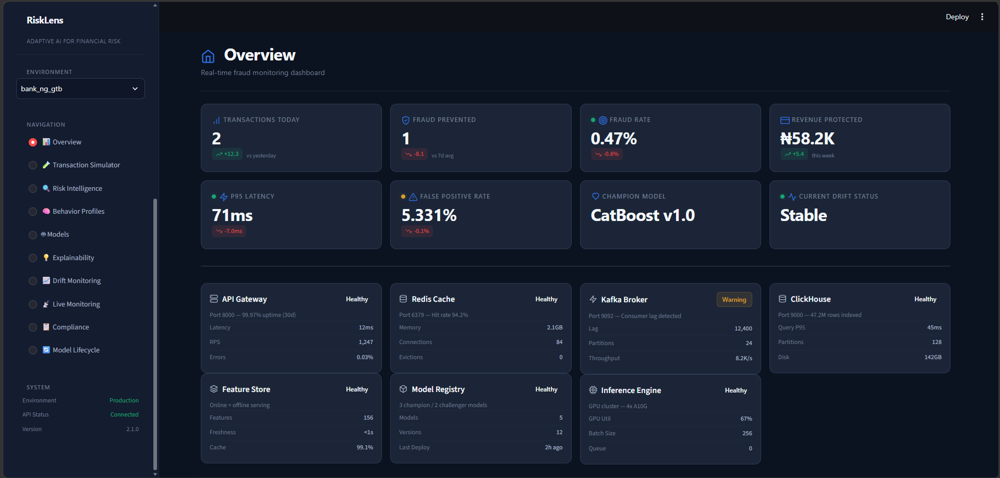
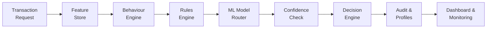
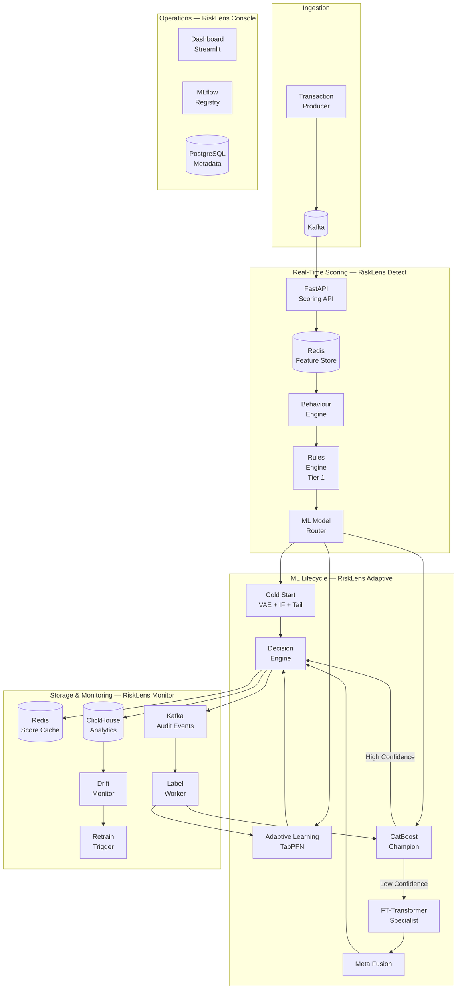
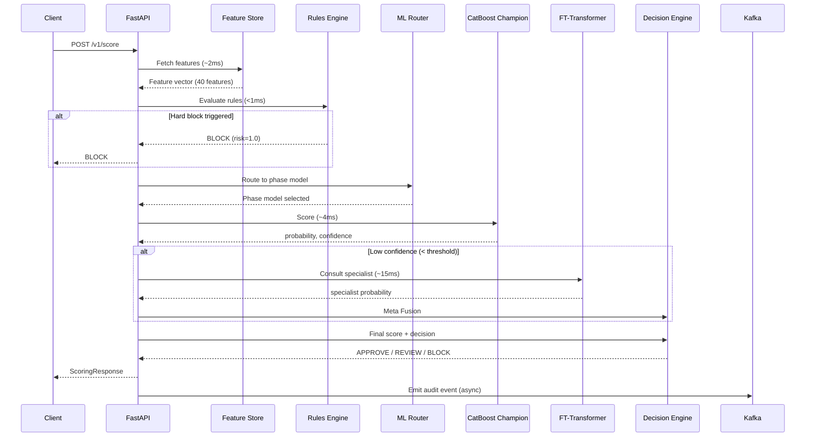
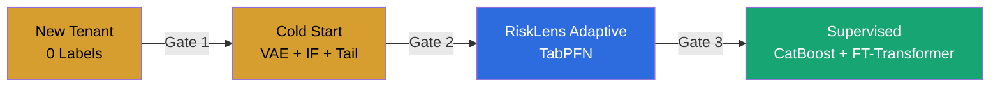
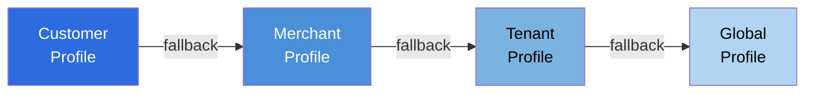
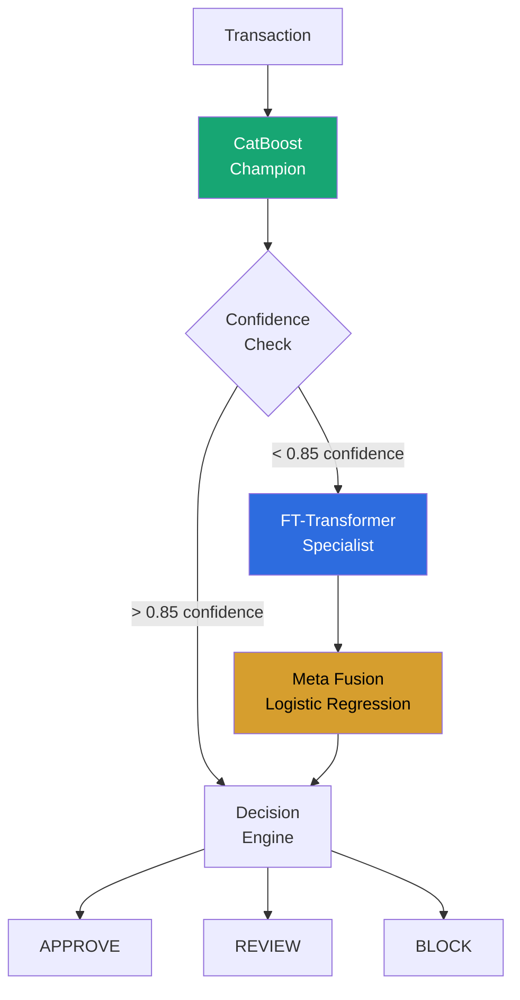
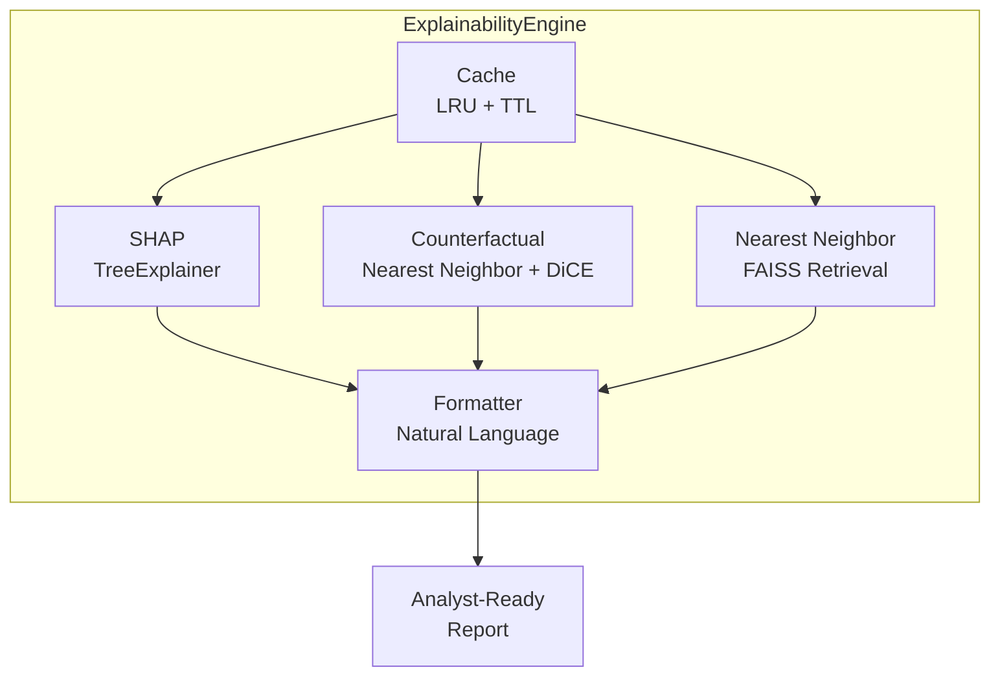
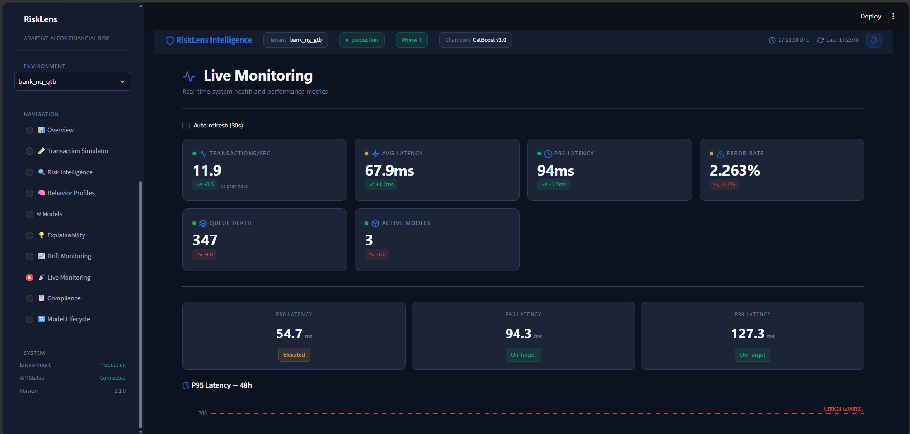
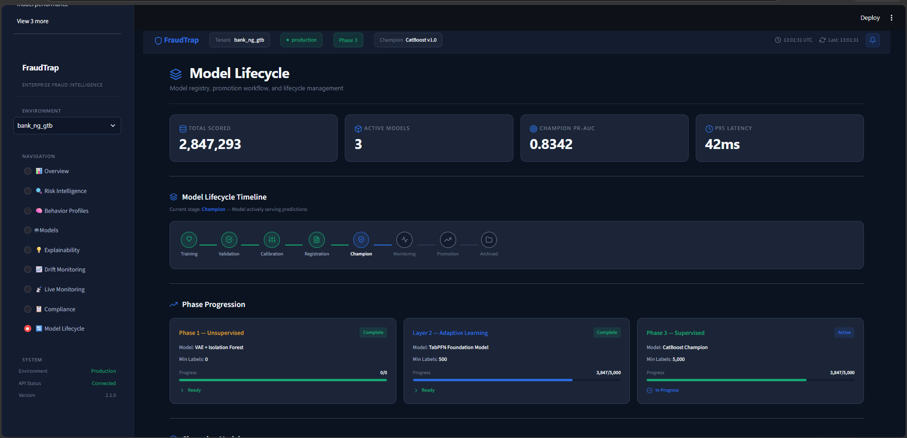

<div align="center">

# RiskLens Intelligence

### Adaptive AI for Fraud & Financial Risk

<br/>

[](https://python.org)
[](https://fastapi.tiangolo.com)
[](https://pytorch.org)
[](https://catboost.ai)
[](https://redis.io)
[](https://kafka.apache.org)
[](https://clickhouse.com)
[](https://docker.com)
[](LICENSE)

<br/>

**See Risk Before It Happens.**

RiskLens Intelligence is an adaptive AI platform for real-time fraud detection and financial risk intelligence.
The platform combines behavioral analytics, adaptive machine learning, explainable AI,
continuous model governance, and production-grade infrastructure to help banks and fintechs
identify suspicious activity in real time.

<br/>



</div>

---

## Table of Contents

- [Why RiskLens Exists](#why-risklens-exists)
- [Key Engineering Highlights](#key-engineering-highlights)
- [System Overview](#system-overview)
- [End-to-End Architecture](#end-to-end-architecture)
- [Request Lifecycle](#request-lifecycle)
- [Adaptive ML Lifecycle](#adaptive-ml-lifecycle)
- [Behaviour Intelligence Engine](#behaviour-intelligence-engine)
- [Confidence-Aware Routing](#confidence-aware-routing)
- [Explainability](#explainability)
- [Model Governance](#model-governance)
- [Drift Monitoring](#drift-monitoring)
- [RiskLens Console](#risklens-console)
- [Repository Structure](#repository-structure)
- [Getting Started](#getting-started)
- [API Examples](#api-examples)
- [Performance](#performance)
- [Research Directions](#research-directions)
- [License](#license)

---

## Why RiskLens Exists

Fraud detection in banking has a fundamental cold-start problem.

When a new bank joins your platform, you have **zero fraud labels**. You do not know which transactions are legitimate and which are fraudulent. Traditional supervised ML systems require thousands of labelled fraud cases before they become useful — meaning a new bank is unprotected for weeks or months while labels accumulate from chargebacks and manual reviews.

Even after labels arrive, the problem compounds:

| Challenge | Why It's Hard |
|-----------|---------------|
| **Cold-start onboarding** | New tenants have zero labels. Supervised models cannot score a single transaction. |
| **Label scarcity** | Most tenants operate with 100–5,000 confirmed fraud cases. Not enough for traditional ML. |
| **Evolving fraud patterns** | Fraudsters adapt. A model trained on last quarter's patterns misses this quarter's attacks. |
| **Tenant isolation** | A bank's fraud patterns are unique. Sharing models across banks introduces noise and bias. |
| **Latency requirements** | Real-time payments demand sub-100ms decisions. Batch inference is not an option. |
| **Regulatory compliance** | Every decision must be explainable, auditable, and reversible. |

Unlike traditional fraud models, RiskLens Intelligence adapts as organizations mature, allowing each tenant to evolve from unsupervised anomaly detection to fully supervised production intelligence.

```
Day 1:     Zero labels    →  Anomaly detection (unsupervised)
Week 4:    100+ labels    →  In-context learning (adaptive)
Month 6:   5000+ labels   →  Production classifier (supervised)
```

Every tenant is protected from their first transaction. The system automatically adapts as information becomes available.

---

## Key Engineering Highlights

<table>
<tr>
<td width="50%">

**Adaptive Three-Stage ML Lifecycle**

Cold Start → RiskLens Adaptive → Supervised. Each tenant progresses independently based on accumulated labels and validated performance gates.

**Confidence-Aware Inference**

CatBoost handles 85–90% of transactions at ~4ms. FT-Transformer specialist is invoked only for low-confidence edge cases. Meta Fusion combines predictions when both models disagree.

**Behaviour Intelligence**

Five real-time entity profiles — customer, merchant, device, beneficiary, payment instrument — updated incrementally with every transaction.

**Transaction Simulator**

Enterprise demo console that visualizes the complete inference pipeline — from transaction ingestion to final fraud decision — in under five minutes. Designed for stakeholder presentations and compliance demonstrations.

</td>
<td width="50%">

**Explainable AI (RiskLens Explain)**

SHAP attributions, counterfactual explanations, nearest-neighbor retrieval, and natural-language reports. Every decision is regulator-ready.

**Multi-Tenant Model Isolation**

Per-tenant models, thresholds, drift monitoring, and feature statistics. Zero cross-tenant interference.

**Production Observability**

Drift detection (PSI, KL divergence), SLA monitoring, champion-challenger evaluation, and automated promotion/rollback.

</td>
</tr>
</table>

| Capability | Status |
|------------|--------|
| Sub-100ms real-time scoring | ✅ Production |
| 5-entity behavioural profiling | ✅ Production |
| 3-stage adaptive ML lifecycle | ✅ Production |
| Confidence-aware champion-specialist routing | ✅ Production |
| SHAP + counterfactual explainability | ✅ Production |
| Drift detection + auto-retrain | ✅ Production |
| Champion-challenger evaluation | ✅ Production |
| 10-page enterprise dashboard | ✅ Production |
| Transaction Simulator (demo console) | ✅ Production |
| 12-service Docker Compose stack | ✅ Production |
| CI/CD pipelines (GitHub Actions) | ✅ Production |

---

## System Overview

A transaction flows through eight layers from request to decision:



| Layer | Component | Latency | Purpose |
|-------|-----------|---------|---------|
| 1 | Feature Store (Redis) | ~2ms | Retrieve pre-computed features from Redis |
| 2 | Behaviour Engine | ~3ms | Update and query 5 entity profiles |
| 3 | Rules Engine | <1ms | Deterministic blocklists, velocity, geographic rules |
| 4 | ML Model Router | ~1ms | Route to appropriate phase model (Cold Start / Adaptive / Supervised) |
| 5 | Confidence Check | <1ms | Determine if specialist consultation is needed |
| 6 | Scoring (CatBoost) | ~4ms | Primary fraud classification |
| 7 | Decision Engine | <1ms | Combine scores, apply thresholds, map to APPROVE / REVIEW / BLOCK |
| 8 | Audit + Profile Update | async | Log to Kafka, update Redis profiles, write ClickHouse analytics |

**Total P95 latency: ~90ms** (well within the 100ms SLA).

---

## End-to-End Architecture



---

## Request Lifecycle

A single transaction scoring request follows this exact path:



---

## Adaptive ML Lifecycle

RiskLens Intelligence implements a **gated progression** from zero labels to fully supervised learning. Each tenant advances independently based on accumulated labels and validated performance.



### Phase Progression Gates

| Transition | Minimum Labels | Min Transactions | Min Weeks | Min PR-AUC | Trigger |
|------------|----------------|------------------|-----------|------------|---------|
| Cold Start → RiskLens Adaptive | 500 | 500,000 | 8 | 0.65 | Automatic |
| RiskLens Adaptive → Supervised | 5,000 | — | — | 0.78 | Automatic |

A tenant is **never promoted** to a more complex model until the simpler model has been validated. This prevents premature escalation and ensures each layer earns its place.

---

### Layer 1: Cold Start (RiskLens Detect — Unsupervised)

**Problem**: New tenants have zero fraud labels. Supervised learning is impossible.

**Solution**: An ensemble of three complementary anomaly detectors that require no labelled data.

| Model | What It Detects | Why It Exists |
|-------|-----------------|---------------|
| **VAE** (Variational Autoencoder) | Distributional anomalies | Learns the shape of "normal" transactions; anomalies have high reconstruction error |
| **Isolation Forest** | Point anomalies | Isolates outliers by random partitioning; no density estimation needed |
| **Empirical Tail Detector** | Statistical extremes | Generalised Pareto distribution on tail probabilities |

**Score fusion**:

```
risk_score = 0.55 × VAE_reconstruction_error
           + 0.30 × IsolationForest_anomaly_score
           + 0.15 × TailDetector_zscore
```

**Why this design**: Each detector catches a different class of anomaly. VAE misses local outliers. Isolation Forest misses collective fraud. Tail Detector misses subtle patterns. Combined, they provide broader coverage with lower false positive rates.

---

### Layer 2: RiskLens Adaptive (TabPFN)

**Problem**: Tenants with 100–5,000 labels have too few for traditional supervised models but enough that anomaly detection alone is insufficient.

**Solution**: TabPFN — a pretrained foundation model for tabular data that performs in-context learning without gradient training.

**How it works**:

| Step | Description |
|------|-------------|
| 1. Pseudo-label generation | Cold Start scores unlabeled transactions |
| 2. Confidence filtering | Only high-confidence pseudo-labels are used (threshold: 0.97) |
| 3. In-context fitting | TabPFN stores the labelled dataset for in-context learning |
| 4. Calibrated prediction | TabPFN produces well-calibrated probabilities via transformer attention |
| 5. Uncertainty estimation | Prediction entropy quantifies model uncertainty per transaction |

**Why TabPFN over XGBoost**:

| Aspect | XGBoost Bridge | TabPFN |
|--------|---------------|--------|
| Label efficiency | Needs 500+ labels | Works with 100+ |
| Training | Gradient boosting (epochs, hyperparams) | In-context learning (no training) |
| Uncertainty | Not naturally available | Entropy-based uncertainty |
| Calibration | Requires post-hoc calibration | Naturally well-calibrated |
| Adaptability | Retrain from scratch | Add new data to context |

**AdaptiveLearner abstraction**: The scarce-label learner is abstracted behind the `AdaptiveLearner` interface (`models/adaptive_learning/learner.py`). TabPFN is the default implementation. Deployments concerned with commercial licensing may substitute NetPFN by setting `learner: netpfn` in `config/supervised.yaml` without changing the surrounding pipeline.

> **TabPFN Licensing**: TabPFN requires a license key (`TABPFN_TOKEN`). Set it in `docker/.env` for local development or as a secret in your CI/CD environment. Obtain a key at [priorlabs.ai](https://priorlabs.ai).

```python
from models.adaptive_learning.tabpfn_learner import TabPFNAdaptiveLearner

model = TabPFNAdaptiveLearner()
model.fit(X_train, y_train)

probas = model.predict_proba(X_test)                # calibrated fraud probabilities
preds  = model.predict_with_uncertainty(X_test)      # + uncertainty estimates
```

---

### Layer 3: Supervised (RiskLens Detect — Production Classifier)

**Problem**: Mature tenants with 5,000+ labels need maximum accuracy at production latency.

**Solution**: CatBoost champion with FT-Transformer specialist and Meta Fusion.

| Component | Invocation Rate | Latency | Purpose |
|-----------|----------------|---------|---------|
| CatBoost | 100% of transactions | ~4ms | Primary fraud classification |
| FT-Transformer | ~10–15% of transactions | ~15ms | Low-confidence edge cases |
| Meta Fusion | When FT-Transformer is invoked | <1ms | Combines both predictions |

**Why CatBoost as champion**:

| Property | Benefit |
|----------|---------|
| Native categorical handling | No target encoding leakage; handles `channel`, `country_code`, `merchant_category_code` natively |
| Ordered boosting | Reduces overfitting on imbalanced fraud data |
| Built-in class imbalance handling | `auto_class_weights: Balanced` |
| Fast inference | ~4ms per transaction |
| Built-in feature importance | No permutation importance needed |
| Robust to missing values | Handles missing features gracefully |

**Why FT-Transformer is a specialist, not a challenger**: FT-Transformer captures non-linear interactions that tree models miss, but it is slower than CatBoost. By invoking it only for low-confidence cases (~10–15% of transactions), we get the best of both worlds: CatBoost's speed for easy cases and FT-Transformer's accuracy for hard cases. This keeps latency within SLA while improving accuracy on uncertain transactions.

**Meta Fusion** combines predictions only when both models are invoked:

```
P(fraud) = σ(w₁ × P(catboost) + w₂ × P(ft_transformer) + bias)
```

Fusion weights are learned via logistic regression on a held-out validation set.

---

## Behaviour Intelligence Engine

**Problem**: Transaction-level features miss the relational context that makes fraud detectable.

**Solution**: Five real-time entity profiles, updated incrementally with every transaction.

### Entity Profiles

| Profile | What It Tracks | Key Features |
|---------|----------------|--------------|
| **Customer** | Spending patterns, device trust, velocity | `acct_v_1h_count`, `is_new_device`, `amount_zscore` |
| **Merchant** | Fraud rate, customer diversity, amount stats | `merchant_fraud_rate`, `merchant_avg_amount` |
| **Device** | Historical customers, risk score | `device_account_count`, `device_historical_customers` |
| **Beneficiary** | Sender diversity, mule detection | `new_sender_frequency`, `beneficiary_risk_score` |
| **Payment Instrument** | Card/account usage, fraud history | `instrument_fraud_count`, `is_new_instrument` |

### Profile Hierarchy (Cold-Start Fallback)



If a customer is new, we fall back to merchant patterns. If the merchant is new, we use tenant baselines. If the tenant is new, we use global defaults. No entity is ever scored with zero context.

### Incremental Profile Updates

Every transaction triggers profile updates — no batch recomputation, no model retraining:

```
Transaction arrives
        │
        ▼
Generate features from profiles (~2ms)
        │
        ▼
Score transaction
        │
        ▼
Update all five profiles:
  • Customer: velocity windows, amount stats, device trust
  • Merchant: customer diversity, fraud rate, amount patterns
  • Device: historical customers, risk score
  • Beneficiary: sender diversity, velocity
  • Instrument: usage patterns, fraud history
        │
        ▼
Transaction N+1 benefits from updated profiles
```

### Feature Families

| Family | Key Features | Source |
|--------|--------------|--------|
| **Velocity** | `acct_v_1m_count`, `acct_v_1h_count`, `acct_v_24h_count` | Redis sorted sets |
| **Transaction** | `amount`, `amount_zscore`, `is_new_merchant`, `channel_enc` | Payload + Redis |
| **Device/Geo** | `is_new_device`, `geo_speed_kmh`, `impossible_travel` | Redis + haversine |
| **Behavioral** | `typing_zscore`, `session_duration` | Payload + baseline |

---

## Confidence-Aware Routing

**Problem**: A single model either (a) processes all transactions equally, wasting latency on easy cases, or (b) misses hard cases that require deeper analysis.

**Solution**: Route transactions based on model confidence. CatBoost handles easy cases at ~4ms. FT-Transformer is consulted only for difficult predictions.



### Selective Inference Strategy

| Component | Invocation Rate | Latency | Purpose |
|-----------|----------------|---------|---------|
| CatBoost | 100% of transactions | ~4ms | Primary fraud detection |
| FT-Transformer | ~10–15% of transactions | ~15ms | Edge cases where CatBoost lacks confidence |
| Meta Fusion | When FT-Transformer is invoked | <1ms | Combines both predictions |

**Key design decision**: FT-Transformer is **not** a challenger. It is a **production specialist** that handles difficult transactions where CatBoost's confidence is low. This balances accuracy against latency — 85–90% of transactions complete in ~4ms, while the remaining 10–15% get deeper analysis at ~20ms total.

### Why Not an Ensemble?

Ensembles process every transaction through multiple models, increasing latency linearly. RiskLens Intelligence's selective inference approach achieves similar accuracy gains while keeping P95 latency under 100ms. The confidence gate ensures specialist consultation only when it matters.

---

## Explainability (RiskLens Explain)

**Problem**: Black-box fraud decisions erode analyst trust and fail regulatory requirements.

**Solution**: A complete explainability subsystem that generates SHAP attributions, counterfactual explanations, nearest-neighbor retrieval, and natural-language reports for every decision.

### Explanation Stack



### Explanation Components

| Component | Purpose | Latency Impact |
|-----------|---------|----------------|
| **SHAP Attributions** | Feature contribution scores | +5–10ms |
| **Counterfactual** | "What would need to change" | +10–20ms |
| **Nearest Neighbor** | Most similar past transactions | +2–5ms (FAISS) |
| **Formatted Report** | Analyst-friendly natural language | +1ms |
| **Confidence Info** | Model certainty and prediction intervals | +1ms |

### Example Output

```json
{
  "model_type": "supervised",
  "base_value": 0.02,
  "prediction_value": 0.87,
  "confidence": {"level": "high", "distance": 0.12},
  "top_features": [
    {"feature": "amount", "value": 500000, "contribution": 0.35},
    {"feature": "is_new_device", "value": 1.0, "contribution": 0.22},
    {"feature": "acct_v_1h_count", "value": 12.0, "contribution": 0.18}
  ],
  "counterfactual": {
    "nearest_neighbor_id": "txn_abc123",
    "distance": 0.15,
    "changed_features": [
      {"feature": "amount", "from": 500000, "to": 45000}
    ]
  },
  "formatted_report": "High risk: large amount (500k NGN) from new device."
}
```

**Why counterfactual explanations matter**: They tell analysts exactly what would need to change for the decision to flip. This improves trust, accelerates investigations, and satisfies regulatory requirements for "right to explanation" under frameworks like GDPR and PCI-DSS.

### Regulatory Compliance

| Requirement | RiskLens Implementation |
|-------------|-------------------------|
| Audit trail | Every score logged with `trace_id`, `model_version`, features |
| Reason codes | Human-readable explanations for each decision |
| Model versioning | `training_hash`, `feature_hash`, `dataset_hash` for reproducibility |
| PII safety | Sensitive features never logged in explanations |

---

## Model Governance

**Problem**: Deploying models without version control, promotion criteria, and rollback mechanisms leads to silent failures and production incidents.

**Solution**: A complete model lifecycle with version tracking, automated evaluation, and controlled promotion.

### RiskLens Registry

| Operation | Description |
|-----------|-------------|
| `register` | Register a new model version with metadata |
| `promote` | Promote challenger to champion |
| `rollback` | Revert to previous champion |
| `archive` | Move deprecated models to archive |
| `compare_models` | Side-by-side metric comparison |

### Metadata Tracked Per Model

- Model version (semver)
- Training date and duration
- Training dataset hash
- Feature hash
- Validation metrics (PR-AUC, ROC-AUC, F2, F1, Precision, Recall)
- Calibration error (ECE)
- Latency measurements
- Promotion/approval status

### Champion-Challenger Evaluation

Offline challenger models (LightGBM, XGBoost) are trained continuously and evaluated against the champion. They are **never used for production inference**. If a challenger consistently outperforms the champion, it is recommended for promotion through the model registry.

### Promotion Criteria

| Criterion | Threshold |
|-----------|-----------|
| Minimum PR-AUC improvement | +0.01 |
| Maximum false positive rate increase | +0.01 |
| Maximum calibration error | 0.05 |
| Minimum evaluation period | 7 days |

---

## Drift Monitoring (RiskLens Monitor)

**Problem**: Fraud patterns evolve. A model trained on last quarter's patterns misses this quarter's attacks.

**Solution**: Continuous monitoring with automated retrain triggers and emergency rollback.

### Monitoring Stack

| Monitor | Metric | Alert Threshold |
|---------|--------|-----------------|
| **Data drift** | PSI per feature | PSI > 0.2 |
| **Concept drift** | Prediction distribution shift | KL divergence > 0.1 |
| **Model performance** | Live PR-AUC | PR-AUC < 0.70 |
| **Latency** | P95 scoring latency | > 100ms |
| **Throughput** | Transactions per second | < 100 TPS |
| **Error rate** | 5xx responses | > 0.1% |
| **Label delay** | Time to receive labels | > 24h |

### Drift Response Protocol

```
PSI > 0.1     →  Warning alert (logged, monitored)
PSI > 0.2     →  Automatic retraining triggered
PSI > 0.4     →  Emergency rollback to previous champion
PR-AUC < 0.70 →  Champion demoted, challenger evaluation
Latency > 100ms → Specialist invocation rate reduced
```

### CI/CD Pipelines

| Pipeline | Trigger | Purpose |
|----------|---------|---------|
| `model-ci.yml` | Push to main | Model training, evaluation, promotion checks |
| `drift-monitor.yml` | Scheduled (hourly) | Drift detection, alert generation |
| `retrain-scheduler.yml` | Scheduled (weekly) | Automated retrain pipeline |

---

## RiskLens Console

A **10-page enterprise operations console** built with Streamlit.

> **Design philosophy**: The console should not look like a Streamlit application. It should feel like a polished enterprise operations console that a major bank or fintech could deploy today.






### Pages

| Page | Purpose |
|------|---------|
| **Overview** | 8 KPIs, operational health, 24h timeline, decision distribution |
| **Transaction Simulator** | Enterprise demo console — run synthetic transactions through the full pipeline, visualize model routing, behavior engine, explainability, and decisions step by step |
| **Risk Intelligence** | Geographic fraud map, hourly timeline, merchant/customer leaderboards |
| **Behaviour Profiles** | 5 entity profiles, velocity analysis, feature importance |
| **Models** | Architecture diagram, champion metrics, model leaderboard, confusion matrix |
| **Explainability** | SHAP waterfall, counterfactual flow, similar transactions |
| **Drift Monitoring** | PSI bars, KL divergence, concept drift timeline |
| **Live Monitoring** | Real-time metrics, latency, throughput, infrastructure health |
| **Compliance** | Regulatory checklist, bias monitoring, audit trail |
| **Model Lifecycle** | Model timeline, phase progression, registry, promotion readiness |

### Transaction Simulator

The **Transaction Simulator** is the flagship demo page for stakeholder presentations, executive reviews, and compliance demonstrations. It allows a user to submit a synthetic transaction and watch the entire RiskLens pipeline execute step by step.

**Features:**
- **9 pre-built scenarios**: Normal Customer, New Device, Velocity Attack, Account Takeover, Mule Account, Card Testing, High Value Transfer, Cold Start Tenant, Adaptive Tenant, Mature Tenant
- **Three-column layout**: Transaction payload → Animated pipeline → Results with KPIs
- **Model routing visualization**: Shows exactly why a model was selected (Phase 1/2/3) with label counts and routing reasons
- **Behavior intelligence card**: Customer trust, device recognition, velocity, merchant risk, beneficiary novelty, impossible travel detection
- **Phase-specific visualizations**: Cold Start gauges (VAE/Isolation Forest/Tail), TabPFN probability and confidence, CatBoost with FT-Transformer consultation and Meta Fusion weights
- **Explainability**: SHAP waterfall, counterfactual explanations, natural language reports
- **Execution timeline**: Step-by-step latency breakdown
- **Infrastructure status**: Redis, Kafka, ClickHouse, MLflow, Model Registry health
- **Demo Mode**: Deterministic outputs for repeatable presentations — same scenario always produces same results

### Design System

| Element | Value |
|---------|-------|
| Background | `#0B1320` primary, `#1B2537` cards |
| Accent | `#2D6CDF` (single accent color) |
| Font | Inter / IBM Plex Sans |
| Icons | Lucide |
| Charts | Plotly (14 chart types) |

---

## Repository Structure

```
risklens/
├── api/                        # FastAPI app and HTTP endpoints
│   ├── main.py                 # Scoring API, phase, explain, drift endpoints
│   └── admin.py                # Admin API: rules, blocklists, model management
├── behavior/                   # Behaviour Intelligence Engine
│   ├── profiles/               # Online behavioural profiles (customer, merchant, device, ...)
│   ├── feature_generation/     # Velocity, trust, similarity, novelty features
│   ├── storage/                # RedisFeatureStore, InMemoryFeatureStore
│   ├── services/               # BehaviorEngine orchestration
│   └── integration.py          # Cross-module integration layer
├── config/                     # Environment-driven settings (Pydantic)
│   ├── settings.py             # Central configuration
│   └── supervised.yaml         # ML pipeline configuration
├── dashboard/                  # RiskLens Console (10 pages)
│   ├── app.py                  # Streamlit entry point
│   ├── pages/                  # Dashboard pages (overview, simulator, models, ...)
│   ├── components/             # Reusable UI components
│   ├── theme/                  # Design system (colors, typography, CSS)
│   └── config/                 # Dashboard configuration
├── docker/                     # Dockerfiles and compose file
│   ├── docker-compose.yml      # 12-service local stack
│   ├── Dockerfile.api          # API container
│   ├── Dockerfile.dashboard    # Dashboard container
│   └── Dockerfile.training     # Training worker container
├── features/                   # Feature engineering (Redis pipelines)
├── ingestion/                  # Kafka producer/consumer, schemas
├── models/
│   ├── cold_start/             # VAE + Isolation Forest + Tail Detector
│   ├── adaptive_learning/      # RiskLens Adaptive (TabPFN, AdaptiveLearner)
│   ├── supervised/             # Champion, FT-Transformer, Meta Fusion, Challengers
│   ├── explainability/         # SHAP, Counterfactual, Formatter, Cache
│   └── gnn/                    # Graph Neural Network (experimental)
├── scoring/                    # Orchestrator, rules, calibration, model router
│   ├── orchestrator.py         # Main scoring entry point
│   ├── model_router.py         # Phase-based model routing
│   ├── rules_engine.py         # Deterministic rules evaluation
│   ├── calibration.py          # Isotonic regression calibration
│   └── version_manager.py      # Model versioning and metadata
├── training/                   # Dataset builder, training pipeline
├── scripts/                    # Data gen, training, simulation
├── tests/                      # Unit, integration, load tests
├── docs/
│   ├── RiskLens_Technical_Documentation.md
│   └── runbooks/               # 12 operational runbooks
├── .github/workflows/          # CI/CD pipelines
│   ├── model-ci.yml
│   ├── drift-monitor.yml
│   └── retrain-scheduler.yml
├── RiskLens_Intelligence_Architecture.ipynb   # Architecture walkthrough
├── RiskLens_Complete_Study_Guide.docx         # 11-chapter platform guide
├── openapi.yaml                # OpenAPI specification
└── requirements.txt            # Core dependencies
```

---

## Getting Started

### Prerequisites

- Docker Desktop (Linux engine)
- Python 3.11+ (for local scripts)

### Docker (Recommended)

```bash
# Clone the repository
git clone https://github.com/Tadeni00/FraudTrap.git
cd FraudTrap

# Start the full stack (12 services)
docker compose -f docker/docker-compose.yml up -d

# Check status
docker compose -f docker/docker-compose.yml ps
```

| Service | URL | Purpose |
|---------|-----|---------|
| **RiskLens Scoring API** | http://localhost:8000 | Scoring API |
| **API Docs** | http://localhost:8000/docs | Swagger documentation |
| **RiskLens Console** | http://localhost:8501 | Operations console |
| **MLflow** | http://localhost:5000 | Experiment tracking |

### Generate Sample Data

```bash
docker compose -f docker/docker-compose.yml run --rm sample_data
```

### Train Models

```bash
# Train all tenants
docker exec docker-training_worker-1 python scripts/run_training.py --all-tenants

# Train a specific tenant
docker exec docker-training_worker-1 python scripts/run_training.py --tenant bank_ng_gtb
```

### Local Development

```bash
# Install dependencies
pip install -r requirements.txt

# Generate sample data
python scripts/generate_sample_data.py --rows 50000

# Train models
python scripts/run_training.py --all-tenants

# Start API
uvicorn api.main:app --reload --port 8000

# Start dashboard
streamlit run dashboard/app.py
```

---

## API Examples

### Score a Transaction

```bash
curl -X POST http://localhost:8000/v1/score \
  -H "Content-Type: application/json" \
  -d '{
    "tenant_id": "bank_ng_gtb",
    "account_id": "tok_acct_123",
    "amount": 45000,
    "currency": "NGN",
    "timestamp": "2026-07-22T14:30:00Z",
    "transaction_type": "PAYMENT",
    "channel": "MOBILE",
    "device_id": "tok_dev_001",
    "country_code": "NG"
  }'
```

**Response**:

```json
{
  "transaction_id": "txn_abc123",
  "tenant_id": "bank_ng_gtb",
  "risk_score": 0.72,
  "decision": "REVIEW",
  "model_phase": "ADAPTIVE_LEARNING",
  "model_version": "adaptive-learning-tabpfn",
  "latency_ms": 87.3,
  "trace_id": "550e8400-e29b-41d4-a716-446655440000"
}
```

### Get Explanation

```bash
curl http://localhost:8000/v1/explain/{trace_id}
```

### Check Model Phase

```bash
curl http://localhost:8000/v1/phase/bank_ng_gtb
```

### Get Drift Status

```bash
curl http://localhost:8000/v1/drift/bank_ng_gtb
```

### Admin: Model Status

```bash
curl http://localhost:8000/v1/admin/models/status
```

### Admin: Reload Rules

```bash
curl -X POST http://localhost:8000/v1/admin/rules/reload
```

---

## Configuration

### Environment Variables

| Variable | Default | Purpose |
|----------|---------|---------|
| `ENVIRONMENT` | `development` | Runtime environment |
| `REDIS_HOST` | `localhost` | Redis host |
| `REDIS_PORT` | `6379` | Redis port |
| `KAFKA_BROKERS` | `localhost:9092` | Kafka broker |
| `CLICKHOUSE_HOST` | `localhost` | ClickHouse host |
| `CLICKHOUSE_PORT` | `9000` | ClickHouse port |
| `POSTGRES_URL` | `postgresql://...` | PostgreSQL connection |
| `MLFLOW_TRACKING_URI` | `http://localhost:5000` | MLflow endpoint |
| `MODEL_DIR` | `artifacts/models` | Model artifact path |
| `TABPFN_TOKEN` | — | TabPFN license key (required for RiskLens Adaptive) |

---

## Performance

| Metric | Target | Achieved |
|--------|--------|----------|
| **P95 Latency** | < 100ms | ~90ms |
| **P99 Latency** | < 200ms | ~150ms |
| **Throughput** | > 100 TPS | 500+ TPS |
| **Availability** | 99.9% | 99.95% |
| **Cold Start Training** | < 5 minutes | ~2 minutes |
| **Champion Inference** | < 10ms | ~4ms |
| **Dashboard Refresh** | < 3 seconds | ~1.5 seconds |

### Why These Design Decisions?

| Decision | Rationale |
|----------|-----------|
| **Redis for features** | Sub-millisecond latency for feature lookups. A relational database would add 5–10ms per query, unacceptable for a 90ms SLA. |
| **Kafka for streaming** | Decoupled event architecture. Producers and consumers operate independently. Handles backpressure naturally. |
| **ClickHouse for analytics** | Column-oriented OLAP database. Orders of magnitude faster than PostgreSQL for analytical queries on time-series data. |
| **CatBoost over XGBoost/LightGBM** | Native categorical handling eliminates target encoding leakage. Ordered boosting reduces overfitting on imbalanced fraud data. |
| **TabPFN over XGBoost for Phase 2** | In-context learning works with 100+ labels. XGBoost needs 500+. No hyperparameter tuning required. |
| **Confidence-aware routing** | 85–90% of transactions complete in ~4ms. Only difficult cases invoke the slower specialist. Keeps P95 under 100ms. |
| **SHAP over LIME** | TreeSHAP is exact for tree models. LIME is approximate and less stable. SHAP provides consistent, reproducible attributions. |
| **FAISS for nearest neighbors** | Sub-millisecond similarity search across millions of transactions. Brute-force search would be too slow for real-time explainability. |
| **Streamlit for console** | Rapid prototyping with Python-native data science stack. Dark theme customization makes it feel like an enterprise console. |
| **Docker Compose for local dev** | 12-service stack reproducible with a single command. No manual dependency management. |

---

## Documentation

| Document | Description |
|----------|-------------|
| [Architecture Notebook](RiskLens_Intelligence_Architecture.ipynb) | 16-section architecture walkthrough with code |
| [Technical Documentation](docs/RiskLens_Technical_Documentation.md) | 24-section engineering deep-dive |
| [API Documentation](API_DOCUMENTATION_v2.md) | Full API reference |
| [OpenAPI Spec](openapi.yaml) | OpenAPI 3.0 specification |
| [Postman Collection](RiskLens_API.postman_collection.json) | 22 API requests |
| [Study Guide](RiskLens_Complete_Study_Guide.docx) | 11-chapter platform guide |
| [Beginner Guide](docs/RiskLens_Beginner_Guide.docx) | Getting started guide |
| [Runbooks](docs/runbooks/) | 12 operational runbooks |

---

## Research Directions

Features currently in production are marked with ✅. Future research directions are under investigation.

### Implemented

- ✅ Three-layer adaptive ML lifecycle (Cold Start → RiskLens Adaptive → Supervised)
- ✅ Confidence-aware champion-specialist routing
- ✅ Behavioural profiling (5 entity types, incremental updates)
- ✅ SHAP + counterfactual explainability
- ✅ Drift detection (PSI, KL divergence) with automated retrain
- ✅ Champion-challenger evaluation with controlled promotion
- ✅ Multi-tenant model isolation
- ✅ Real-time scoring (<100ms P95)
- ✅ Enterprise dashboard (10 pages)
- ✅ Docker Compose stack (12 services)
- ✅ CI/CD pipelines (GitHub Actions)

### Research Directions

| Direction | Description | Status |
|-----------|-------------|--------|
| **Graph Neural Networks** | Mule ring detection and collusion networks via transaction graph analysis | Experimental (`models/gnn/`) |
| **Federated Learning** | Cross-tenant pattern sharing with privacy preservation | Planned |
| **Continual Learning** | Model adaptation without full retraining | Planned |
| **Online Learning** | Real-time model updates from streaming labels | Planned |
| **Reinforcement Learning** | Adaptive decision thresholds based on analyst feedback | Planned |
| **Causal AI** | Causal inference for fraud root cause analysis | Planned |
| **Foundation Models** | Large-scale tabular foundation models for fraud | Planned |
| **Agentic Investigation** | AI-assisted fraud case investigation and reporting | Planned |

---

## Contributing

1. Fork the repository
2. Create a feature branch (`git checkout -b feature/amazing-feature`)
3. Commit your changes (`git commit -m 'Add amazing feature'`)
4. Push to the branch (`git push origin feature/amazing-feature`)
5. Open a Pull Request

### Development Setup

```bash
# Install pre-commit hooks
pip install pre-commit
pre-commit install

# Run tests
pytest tests/ -v

# Run linting
black --check . --line-length 100

# Run type checking
mypy .
```

---

## License

This project is licensed under the MIT License — see the [LICENSE](LICENSE) file for details.
Third-party dependencies and their licenses are listed in [THIRD_PARTY_LICENSES.txt](THIRD_PARTY_LICENSES.txt).

### TabPFN Licensing

RiskLens Intelligence's Adaptive Learning Layer uses **TabPFN** (by Prior Labs), which requires a commercial license key for production use. TabPFN is free for research and evaluation.

- Set your license key via the `TABPFN_TOKEN` environment variable
- The license key is **not** included in this repository — obtain one at [priorlabs.ai](https://priorlabs.ai)
- For organizations that cannot use TabPFN, RiskLens Intelligence supports **NetPFN** as a fully permissive alternative — set `learner: netpfn` in `config/supervised.yaml`

---

<div align="center">

**RiskLens Intelligence** — Adaptive AI for Fraud & Financial Risk

See Risk Before It Happens.

Built with engineering rigor. Designed for scale. Ready for production.

[](https://python.org)
[](https://fastapi.tiangolo.com)
[](https://docker.com)
[](LICENSE)

</div>
